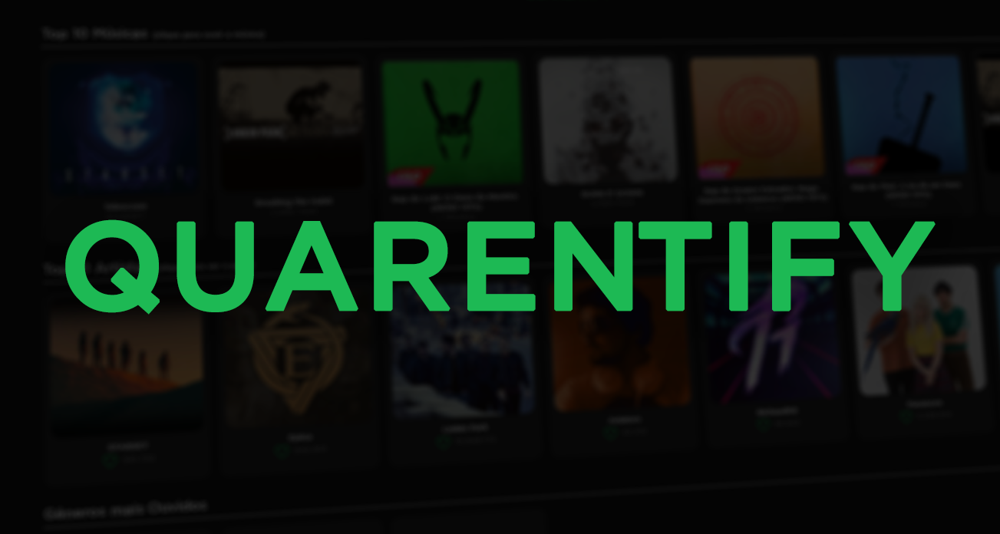
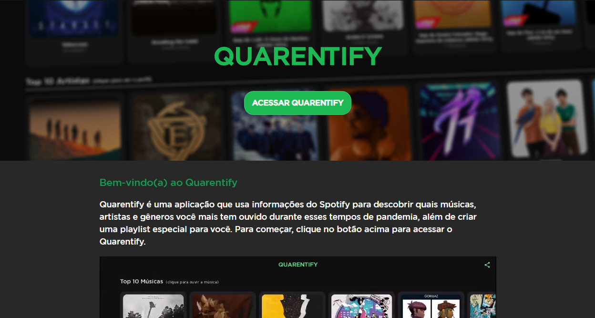
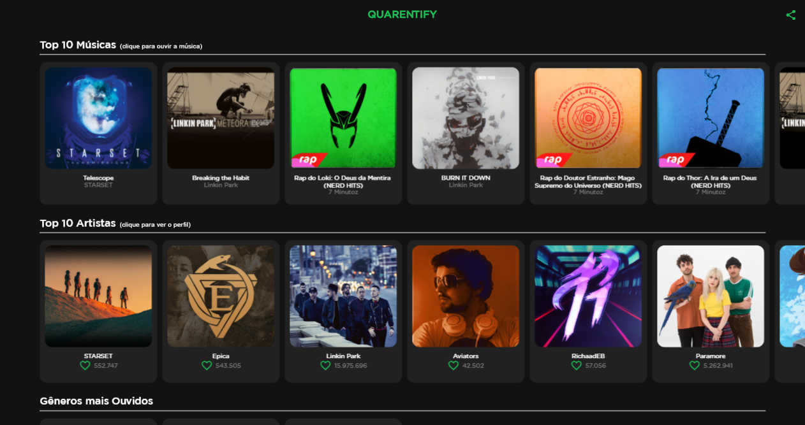

# Quarentify

https://quarentify.agst.dev

Use a neat interface to check your Spotify stats while you stayed at home.
This project was created and deployed while the COVID-19 pandemic was still at large at Brazil.
It uses the Spotify API and the Flutter web framework to display stats such as the tracks and artists you listened to the most.
It also uses the just mentioned data to learn a little about the user's preferred genres and to create them a recommended playlist.

#### Some app main features:
* Your top 10 heard musics.
* Your top 10 heard artists.
* Most heard music genres.
* Create a personalized playlist based on the musics you heard.
* Share your quarentify to Twitter.

#### Some application images:

